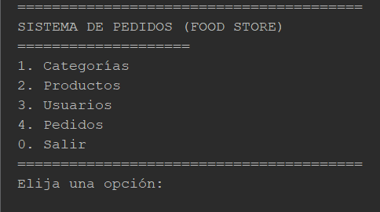
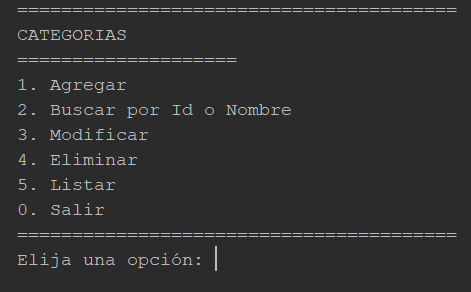
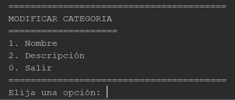

# Trabajo Práctico Integrador — Programación II
# Sistema de Pedidos (FOOD STORE)

## Autor
Rolando Nebreda - DNI 18.350.686

## Descripción general
Se propone desarrollar un sistema de consola llamado Food Store, orientado a la gestión de productos de un negocio de comidas mediante una aplicación Java basada en Programación Orientada a Objetos (POO). 
El sistema permitirá gestionar categorías, productos, usuarios y pedidos (según el UML provisto), realizando operaciones CRUD completas desde un menú de opciones en consola. El acceso se realizará directamente a través del menú para ejecutar altas, bajas, modificaciones y consultas (no se implementará login). 

## Objetivos de Aprendizaje
• Modelar correctamente clases y relaciones del UML (asociaciones 1..N y N..1).

• Aplicar herencia (clase base) y sobrescritura de métodos.

• Utilizar estructuras de datos dinámicas (Colecciones) para gestionar las entidades.

• Implementar Interfaces para estandarizar comportamientos.

• Gestionar errores creando y capturando Excepciones propias.

## Instalación y ejecución
Clonar el repositorio: git clone https://github.com/rnebreda/TP-INTEGRADOR---PROGRAMACION-II.git

## Ejemplo de Uso

### Menú Principal
Al ingresar al Sistema se ofrece un menú de opciones para acceder a los distintos módulos del programa.

Luego cada Módulo gestiona la Entidad correspondiente. A continuación se muestra el ejemplo del módulo de Gestión de Categorías:

### Menú Categorías

### Menú Modificar Categorías

# Manual de Uso del Sistema (completo)
Para una descripción completa del uso del Sistema ver el siguiente archivo pdf.

[Manual de Uso del Sistema](Docs/UsoDelSistema.pdf)

Video explicativo:

